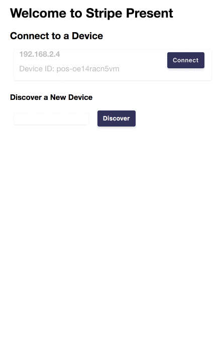

# react-stripe-pos

> React bindings for Stripe WebPOS SDK

[](https://www.npmjs.com/package/react-stripe-pos) [](https://standardjs.com)

## Install

```bash
npm install --save react-stripe-pos
```

## Demo Application




Run the example application for this component by doing:

```
cd ./example
yarn start
```

## Usage

Example Usage:
```jsx
import React, { Component } from 'react'
import MyPOSComponent from './MyPOSComponent'

class App extends Component {
    render () {
        return (
            <div className="StripePOS" style={{
              margin: 'auto',
              width: '30%'
            }}>
              <h1>Welcome to Stripe Present</h1>
              <MyPOSComponent
                basketItems={[{
                  description: 'Yellow Hat',
                  totalPrice: 30000,
                  unitPrice: 10000,
                  quantity: 3
                }]}
                taxRate={0.07}
                activationTokenRequestHandler={createPosActivationToken}
                discoveryTokenRequestHandler={registerDevice}
                paymentIntentRequestHandler={createIntent}/>
            </div>
        )
    }
}

export default App

```

In your `MyPOSComponent` component, wrap it with the `POSDevice` react high-order-component (HOC):

```jsx

class POSPayment extends Component {
  render () {
    return (
      <div>
        <h1>Checkout Basket</h1>
        <div className="row">
            {this.props.stripePos.basketItems.map(item => 
                <div className="list-item">
                    <p>Description:{item.description}</p>
                    <p>Price: ${item.unitPrice.toFixed(2)} each</p>
                    <p>Amount: ${item.totalPrice.toFixed(2)}</p>
                </div>)}
        </div>
        <div className="row right">
            <p>Sub Total: ${this.props.stripePos.totals.total.toFixed(2)}</p>
            <p>Tax: ${this.props.stripePos.totals.tax.toFixed(2)}</p>
            <p>Total: ${this.props.stripePos.totals.balanceDue.toFixed(2)}</p>
        </div>
        <div className="row">
            <div class="col s6">
                <button disabled={this.props.stripePos.connectionStatus !== 'connected'} className="btn" onClick={() => this.props.stripePos.addBasketItem({
                    description: 'Silver Hat',
                    totalPrice: 20.00,
                    unitPrice: 10.00,
                    quantity: 2
                })}>Add Item</button>
            </div>
            <div class="col s6">
                <button disabled={this.props.stripePos.connectionStatus !== 'connected'} className="btn">Create ${this.props.stripePos.totals.balanceDue} Charge</button>
            </div>
            <h3>Device Status: {this.props.stripePos.connectionStatus}</h3>
        </div>
      </div>
    )
  }
}

export default POSDevice(POSPayment)
```

Your component will be exposed a series of Stripe POS-specific properties such as `props.stripePos.connectionStatus` which you can render.

### Request Handlers

This component requires you to implement 3 request handlers to call your backend API:

- async function registerDevice(pairingCode) 
- async function createPosActivationToken(posDeviceId)
- async function createIntent(amount, description)

TODO - Add more details on the signatures required of these handlers.


# Development

## Running Tests

Running Tests - TODO

## License

MIT © [sedouard](https://github.com/sedouard)
